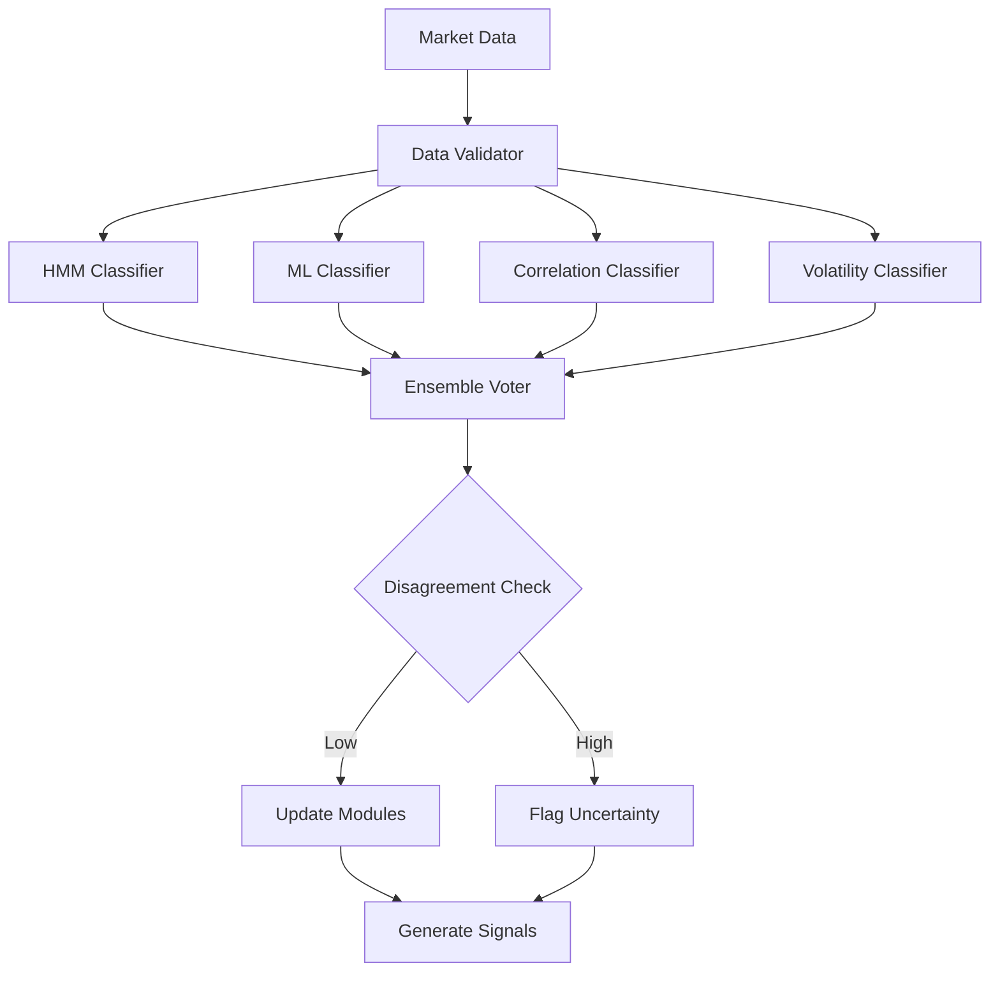

# AMRCAIS Development Rules

## Project: Adaptive Multi-Regime Cross-Asset Intelligence System
**Version:** 1.0  
**Last Updated:** February 4, 2026  
**Status:** Active Development

---

## Table of Contents

1. [Core Principles](#core-principles)
2. [Architecture Standards](#architecture-standards)
3. [Code Organization](#code-organization)
4. [Coding Standards](#coding-standards)
5. [Data Management](#data-management)
6. [Model Development](#model-development)
7. [Testing Requirements](#testing-requirements)
8. [Documentation Standards](#documentation-standards)
9. [Performance Guidelines](#performance-guidelines)
10. [Security & Ethics](#security--ethics)
11. [Git Workflow](#git-workflow)
12. [Deployment Rules](#deployment-rules)

---

## Core Principles

### 1. Regime-First Design
**RULE:** Every analytical component must be regime-aware.

- All models, signals, and parameters MUST have regime-specific configurations
- Never implement a static threshold or fixed parameter without justifying why it shouldn't vary by regime
- Default behavior: Check current regime BEFORE interpreting any signal

**Example:**
```python
# ❌ BAD: Static interpretation
if yield_curve_steepness > 0.5:
    signal = "bullish"

# ✅ GOOD: Regime-conditional interpretation
regime = regime_classifier.get_current_regime()
if regime == "risk_on_growth":
    signal = "bullish" if yield_curve_steepness > 0.5 else "neutral"
elif regime == "stagflation":
    signal = "bearish" if yield_curve_steepness > 0.5 else "neutral"
```

### 2. Explainability Over Complexity
**RULE:** If you can't explain why the system made a decision in one sentence, it's too complex.

- Prioritize interpretable models (HMM, Random Forest with feature importance) over black boxes
- Every output must include a human-readable explanation
- Log decision rationale for all regime classifications and signal interpretations

### 3. Fail Gracefully
**RULE:** The system should degrade gracefully when components fail.

- If one classifier crashes, use the remaining classifiers
- If data is missing, use fallback sources or indicate uncertainty
- Never crash the entire system due to a single module failure

### 4. Data Quality First
**RULE:** Garbage in, garbage out. Validate data rigorously.

- Check for NaN, inf, outliers, and suspicious values BEFORE feeding to models
- Log all data quality issues
- When in doubt, flag data as unreliable rather than using questionable inputs

---

## Architecture Standards

### Layer 1: Regime Detection Engine

#### Classifier Requirements
- MUST implement at least 4 independent classifiers:
  1. Hidden Markov Model (Gaussian HMM with 4 states)
  2. Random Forest Classifier
  3. Correlation-Based Clustering
  4. Volatility Regime Detector

- Each classifier MUST output:
  - Primary regime classification (1-4)
  - Confidence score (0.0 to 1.0)
  - Regime probabilities for all states

#### Ensemble Logic
```python
# MANDATORY: Weighted voting with disagreement tracking
def get_regime_consensus(classifiers):
    """
    Returns: (primary_regime, confidence, disagreement_index)
    """
    votes = [c.predict_regime() for c in classifiers]
    weights = [c.get_confidence() for c in classifiers]
    
    # Weighted majority vote
    primary = weighted_vote(votes, weights)
    
    # Disagreement = variance in votes weighted by confidence
    disagreement = calculate_disagreement_index(votes, weights)
    
    return primary, np.mean(weights), disagreement
```

### Layer 2: Analytical Modules

#### Module Interface Standard
ALL modules MUST implement this interface:

```python
class AnalyticalModule(ABC):
    @abstractmethod
    def update_regime(self, regime: int, confidence: float):
        """Called when regime changes. Update internal parameters."""
        pass
    
    @abstractmethod
    def analyze(self, data: pd.DataFrame) -> Dict:
        """
        Returns: {
            'signal': str,
            'strength': float,
            'explanation': str,
            'regime_context': str
        }
        """
        pass
    
    @abstractmethod
    def get_regime_parameters(self, regime: int) -> Dict:
        """Return current regime-specific parameters."""
        pass
```

#### Required Modules
1. **MacroEventTracker**
   - Monitor: NFP, CPI, Core PCE, FOMC decisions, PMI
   - Regime-specific impact weights
   - Surprise index calculation

2. **YieldCurveAnalyzer**
   - Curve types: parallel shift, steepener, flattener, butterfly
   - Duration, DV01, convexity calculations
   - Regime-conditional interpretation of curve moves

3. **OptionsSurfaceMonitor**
   - Clean option chains (outlier removal)
   - Interpolate IV surfaces using SABR or cubic splines
   - Skew analysis with regime-dependent thresholds

4. **FactorExposureAnalyzer**
   - Factors: Value, Momentum, Quality, Low-Vol, Size
   - Rolling regression (60/120-day windows)
   - PCA for latent factor extraction

5. **CorrelationAnomalyDetector**
   - Track: SPX-TLT, SPX-GLD, DXY-commodities, equity-volatility
   - Z-score deviations from regime baseline
   - Regime transition indicators

### Layer 3: Meta-Learning

#### Performance Tracking
```python
# MANDATORY: Track every regime classification
class RegimePerformanceTracker:
    def log_classification(self, timestamp, predicted_regime, 
                          classifiers_agreement, market_data):
        """Log regime prediction with context."""
        pass
    
    def evaluate_accuracy(self, lookback_days=30):
        """
        Evaluate if regime stayed stable or if we misclassified.
        Use market volatility, correlation changes as ground truth.
        """
        pass
    
    def trigger_recalibration(self) -> bool:
        """Return True if error rate exceeds 25% over 2 weeks."""
        pass
```

#### Recalibration Rules
- **TRIGGER:** If regime classification changes >3 times in 5 days, increase confidence threshold
- **TRIGGER:** If disagreement index stays >0.7 for >10 days, flag for manual review
- **TRIGGER:** If predicted regime performance diverges from expected (e.g., "risk-on" but SPX down 5 consecutive days), recalibrate

---

## Code Organization

### Directory Structure (MANDATORY)
```
amrcais/
├── README.md
├── RULES.md                    # This file
├── requirements.txt
├── setup.py
├── config/
│   ├── regimes.yaml           # Regime definitions
│   ├── data_sources.yaml      # API keys, endpoints
│   └── model_params.yaml      # Hyperparameters by regime
├── data/
│   ├── raw/                   # Never commit to git
│   ├── processed/             # Never commit to git
│   └── validation/            # Sample test data (commit)
├── src/
│   ├── __init__.py
│   ├── regime_detection/
│   │   ├── __init__.py
│   │   ├── hmm_classifier.py
│   │   ├── ml_classifier.py
│   │   ├── correlation_classifier.py
│   │   ├── volatility_classifier.py
│   │   └── ensemble.py
│   ├── modules/
│   │   ├── __init__.py
│   │   ├── base_module.py     # Interface definition
│   │   ├── macro_events.py
│   │   ├── yield_curve.py
│   │   ├── options_surface.py
│   │   ├── factor_exposure.py
│   │   └── correlation_anomaly.py
│   ├── meta_learning/
│   │   ├── __init__.py
│   │   ├── performance_tracker.py
│   │   └── recalibration.py
│   ├── data_pipeline/
│   │   ├── __init__.py
│   │   ├── fetchers.py        # API data fetching
│   │   ├── validators.py      # Data quality checks
│   │   └── storage.py         # Database operations
│   └── utils/
│       ├── __init__.py
│       ├── config_loader.py
│       ├── logging_setup.py
│       └── visualization.py
├── tests/
│   ├── unit/                  # Test individual components
│   ├── integration/           # Test module interactions
│   └── backtest/              # Historical validation
├── notebooks/
│   ├── 01_data_exploration.ipynb
│   ├── 02_regime_validation.ipynb
│   └── 03_backtest_analysis.ipynb
├── dashboard/                 # Streamlit or React app
│   ├── app.py
│   └── components/
└── docs/
    ├── architecture.md
    ├── api_reference.md
    └── user_guide.md
```

### Import Standards
```python
# ✅ GOOD: Absolute imports
from src.regime_detection.ensemble import RegimeEnsemble
from src.modules.macro_events import MacroEventTracker

# ❌ BAD: Relative imports for cross-module dependencies
from ..regime_detection.ensemble import RegimeEnsemble
```

---

## Coding Standards

### Python Version
- **REQUIRED:** Python 3.10 or higher
- Reason: Type hints, match statements, improved performance

### Style Guide
- **MANDATORY:** Follow PEP 8
- Line length: 100 characters (not 79, we're not in 1990)
- Use `black` for auto-formatting
- Use `pylint` with score ≥ 8.5/10

### Type Hints (MANDATORY)
```python
# ✅ GOOD: Fully typed
def calculate_regime_score(
    returns: pd.Series,
    volatility: pd.Series,
    lookback: int = 30
) -> Tuple[int, float]:
    """Calculate regime classification score.
    
    Args:
        returns: Daily returns series
        volatility: Realized volatility series
        lookback: Rolling window size in days
        
    Returns:
        Tuple of (regime_id, confidence_score)
    """
    pass

# ❌ BAD: No type hints
def calculate_regime_score(returns, volatility, lookback=30):
    pass
```

### Error Handling
```python
# ✅ GOOD: Specific exceptions with context
try:
    data = fetch_fred_data("DGS10")
except requests.HTTPError as e:
    logger.error(f"FRED API error: {e}. Falling back to cached data.")
    data = load_cached_data("DGS10")
except ValueError as e:
    logger.error(f"Invalid data format: {e}")
    raise DataValidationError(f"DGS10 data corrupted: {e}")

# ❌ BAD: Bare except
try:
    data = fetch_fred_data("DGS10")
except:
    pass
```

### Logging Standards
```python
import logging

# MANDATORY: Use this logging pattern
logger = logging.getLogger(__name__)

# Log levels:
# DEBUG: Detailed diagnostic (e.g., "Fetched 1250 rows from yfinance")
# INFO: Key events (e.g., "Regime changed: Risk-On → Stagflation")
# WARNING: Recoverable issues (e.g., "Missing data for 2025-01-15, using interpolation")
# ERROR: Serious problems (e.g., "All classifiers failed, cannot determine regime")
# CRITICAL: System-breaking (e.g., "Database connection lost, shutting down")

# ✅ GOOD: Contextual logging
logger.info(
    f"Regime classification: {regime_name} "
    f"(confidence={confidence:.2f}, disagreement={disagreement:.2f})"
)

# ❌ BAD: Vague logging
logger.info("Classified regime")
```

### Configuration Management
**RULE:** Never hardcode parameters. Use YAML configs.

```yaml
# config/regimes.yaml
regimes:
  1:
    name: "Risk-On Growth"
    macro_event_weights:
      NFP: 1.2
      CPI: 0.8
      FOMC: 1.0
    yield_curve_interpretation:
      steepening: "bullish"
      flattening: "bearish"
    factor_preferences: ["momentum", "growth"]
    
  2:
    name: "Risk-Off Crisis"
    macro_event_weights:
      NFP: 0.3
      CPI: 0.5
      FOMC: 1.5
    yield_curve_interpretation:
      steepening: "flight_to_quality"
      flattening: "recession_fear"
    factor_preferences: ["low_volatility", "quality"]
```

---

## Data Management

### Data Sources (Priority Order)
1. **Primary:** FRED API (federal reserve economic data)
2. **Secondary:** yfinance (equity/ETF prices)
3. **Tertiary:** Alpha Vantage or Polygon.io (intraday data)
4. **Fallback:** Cached historical data (maximum 7 days old)

### Data Validation Rules
```python
class DataValidator:
    """MANDATORY: Run on all incoming data."""
    
    def validate_price_data(self, df: pd.DataFrame) -> pd.DataFrame:
        """
        Checks:
        1. No NaN in OHLCV columns
        2. Close price > 0
        3. High >= Low
        4. Volume >= 0
        5. No >20% single-day moves (flag, don't drop)
        6. Date index is monotonic
        """
        pass
    
    def validate_macro_data(self, df: pd.DataFrame) -> pd.DataFrame:
        """
        Checks:
        1. Values within historical min/max ± 3 std dev
        2. No future dates
        3. Frequency matches expected (monthly/quarterly)
        """
        pass
```

### Data Storage
- **Raw data:** SQLite for development, PostgreSQL for production
- **Processed features:** Parquet files (efficient compression)
- **Model checkpoints:** Pickle for scikit-learn models
- **Results/backtests:** CSV + JSON metadata

### Caching Strategy
```python
# RULE: Cache expensive computations
from functools import lru_cache
import joblib

@lru_cache(maxsize=128)
def get_correlation_matrix(start_date: str, end_date: str, window: int):
    """Cache correlation matrices for repeated backtests."""
    pass

# RULE: Persist model states
def save_regime_classifier(classifier, filepath: Path):
    joblib.dump(classifier, filepath)
    logger.info(f"Saved classifier to {filepath}")
```

---

## Model Development

### Training Data Rules
1. **Walk-Forward Validation ONLY**
   - Never use future data to predict the past
   - Training window: Expanding (start from 2010, add one day at a time)
   - Test window: 1 day ahead

2. **Regime Labeling**
   - Use multiple expert annotations if possible
   - When uncertain, label as "transition" regime (to be filtered)
   - Validate labels against known market events (2008 crisis, 2020 COVID, etc.)

3. **Train/Test Split**
   - Train: 2010-01-01 to 2022-12-31
   - Validation: 2023-01-01 to 2024-12-31
   - Test: 2025-01-01 to present
   - **NEVER** optimize on test set

### Model Selection Criteria
```python
# RULE: Use cross-validation with temporal splits
from sklearn.model_selection import TimeSeriesSplit

tscv = TimeSeriesSplit(n_splits=5)

for train_idx, val_idx in tscv.split(X):
    X_train, X_val = X[train_idx], X[val_idx]
    y_train, y_val = y[train_idx], y[val_idx]
    
    # Train and evaluate
    model.fit(X_train, y_train)
    score = model.score(X_val, y_val)
```

### Hyperparameter Tuning
- Use `GridSearchCV` with TimeSeriesSplit
- Optimize for regime classification accuracy (primary) and stability (secondary)
- Document all hyperparameter choices in `config/model_params.yaml`

### Model Evaluation Metrics
**MANDATORY:** Report all of these metrics:

1. **Classification Accuracy:** Overall % correct regime predictions
2. **Regime Stability:** Average days regime persists before flip
3. **Transition Detection Latency:** Days from actual to detected regime change
4. **Disagreement Predictive Power:** Does disagreement >0.6 precede transitions?
5. **Economic Significance:** Do regime-based strategies outperform static models?

---

## Testing Requirements

### Unit Tests (MANDATORY)
- **Coverage:** Minimum 80% code coverage
- **Tools:** pytest, pytest-cov
- Test every public method in every class

```python
# tests/unit/test_regime_detection.py
import pytest
from src.regime_detection.hmm_classifier import HMMClassifier

def test_hmm_classifier_initialization():
    """Test that HMM initializes with correct parameters."""
    classifier = HMMClassifier(n_states=4)
    assert classifier.n_states == 4
    assert classifier.model is not None

def test_hmm_regime_prediction():
    """Test regime prediction on synthetic data."""
    classifier = HMMClassifier(n_states=4)
    returns = np.random.randn(100)  # Synthetic data
    
    regime, confidence = classifier.predict(returns)
    
    assert 1 <= regime <= 4
    assert 0 <= confidence <= 1
```

### Integration Tests
```python
# tests/integration/test_regime_module_integration.py
def test_regime_change_propagates_to_modules():
    """Ensure regime change updates all analytical modules."""
    ensemble = RegimeEnsemble()
    modules = [MacroEventTracker(), YieldCurveAnalyzer()]
    
    # Trigger regime change
    ensemble.update_regime(new_regime=2)
    
    for module in modules:
        assert module.current_regime == 2
        assert module.parameters_updated == True
```

### Backtesting Framework
```python
# tests/backtest/test_historical_regimes.py
def test_2020_covid_crash_detection():
    """Verify system detects March 2020 regime shift to Risk-Off."""
    start_date = "2020-02-01"
    end_date = "2020-04-01"
    
    results = run_backtest(start_date, end_date)
    
    # March 2020 should be classified as Risk-Off Crisis
    march_regimes = results[results.index.month == 3]['regime']
    assert (march_regimes == 2).mean() > 0.8  # 80%+ of March in Regime 2
```

### Test Data
- Keep synthetic test data in `data/validation/`
- **NEVER** use production API keys in tests (use mocks)

```python
# ✅ GOOD: Mock external API calls
from unittest.mock import patch

@patch('src.data_pipeline.fetchers.fetch_fred_data')
def test_macro_event_tracker(mock_fetch):
    mock_fetch.return_value = pd.DataFrame({'value': [150000]})
    
    tracker = MacroEventTracker()
    result = tracker.analyze_nfp_release()
    
    assert result['signal'] in ['bullish', 'bearish', 'neutral']
```

---

## Documentation Standards

### Code Documentation
```python
# MANDATORY: Google-style docstrings
def calculate_disagreement_index(
    classifiers: List[RegimeClassifier],
    weights: Optional[List[float]] = None
) -> float:
    """Calculate regime disagreement index across classifiers.
    
    The disagreement index measures how much classifiers disagree on the
    current regime. Higher values (closer to 1.0) indicate regime uncertainty.
    
    Args:
        classifiers: List of trained regime classifiers
        weights: Optional confidence weights for each classifier.
                 If None, uses equal weights.
    
    Returns:
        Disagreement index between 0.0 (full agreement) and 1.0 (max disagreement)
    
    Raises:
        ValueError: If classifiers list is empty or weights length doesn't match
    
    Examples:
        >>> clf1 = HMMClassifier()
        >>> clf2 = MLClassifier()
        >>> disagreement = calculate_disagreement_index([clf1, clf2])
        >>> print(f"Disagreement: {disagreement:.2f}")
        Disagreement: 0.35
    
    Notes:
        Disagreement is calculated as weighted variance of regime predictions.
        Values >0.6 historically precede regime transitions.
    """
    pass
```

### README Requirements
The project README.md MUST contain:
1. Project overview and motivation
2. Installation instructions (one-command if possible)
3. Quick start example
4. Architecture diagram
5. Links to detailed docs
6. Citation/attribution

### Architecture Documentation
- Maintain `docs/architecture.md` with system design decisions
- Update whenever major changes are made
- Include mermaid diagrams for visual clarity

```markdown
## Regime Detection Flow

\```

### API Reference
- Auto-generate from docstrings using Sphinx
- Host on Read the Docs or GitHub Pages
- Update with every release

---

## Performance Guidelines

### Computational Efficiency
1. **Vectorization MANDATORY**
   ```python
   # ✅ GOOD: Vectorized operations
   returns = (prices / prices.shift(1) - 1).dropna()
   
   # ❌ BAD: Loops
   returns = []
   for i in range(1, len(prices)):
       returns.append(prices[i] / prices[i-1] - 1)
   ```

2. **Profiling Requirements**
   - Profile critical paths with `cProfile` before optimizing
   - Target: <5 seconds for daily regime update
   - Target: <2 minutes for full 15-year backtest

3. **Memory Management**
   - Don't load entire dataset into memory if >1GB
   - Use chunking for large CSVs
   - Delete large dataframes when done

### Database Optimization
```python
# RULE: Use indexed queries
CREATE INDEX idx_date ON market_data(date);
CREATE INDEX idx_ticker_date ON prices(ticker, date);

# RULE: Batch inserts
def insert_prices_batch(df: pd.DataFrame, batch_size: int = 1000):
    """Insert prices in batches to avoid memory bloat."""
    for i in range(0, len(df), batch_size):
        batch = df.iloc[i:i+batch_size]
        batch.to_sql('prices', engine, if_exists='append')
```

---

## Security & Ethics

### API Key Management
**RULE:** NEVER commit API keys to git.

```python
# ✅ GOOD: Load from environment
import os
from dotenv import load_dotenv

load_dotenv()
FRED_API_KEY = os.getenv("FRED_API_KEY")

if not FRED_API_KEY:
    raise ValueError("FRED_API_KEY not found in environment")

# ❌ BAD: Hardcoded
FRED_API_KEY = "abc123def456"  # NEVER DO THIS
```

### Data Privacy
- This system uses ONLY public market data
- Do NOT ingest any proprietary or insider information
- Flag and reject any user-uploaded data that appears non-public

### Ethical Use
**PROHIBITED USES:**
1. Market manipulation (coordinated trading based on signals)
2. Front-running retail investors
3. Claiming this system is "financial advice" without proper disclaimers

**REQUIRED DISCLAIMER:**
```
This system is for educational and research purposes only. 
It does not constitute financial advice. Past performance does not 
guarantee future results. Markets can remain irrational longer than 
you can remain solvent.
```

---

## Git Workflow

### Branch Strategy
```
main          # Production-ready code only
├── develop   # Integration branch
    ├── feature/regime-hmm
    ├── feature/macro-events
    ├── bugfix/correlation-nan-handling
    └── hotfix/data-fetch-timeout
```

### Commit Message Format
```
<type>(<scope>): <subject>

<body>

<footer>
```

**Types:** feat, fix, docs, style, refactor, test, chore

**Example:**
```
feat(regime): Add volatility-based regime classifier

- Implements regime detection based on VIX levels
- Uses 20/30/50 VIX thresholds for low/med/high vol regimes
- Adds unit tests for edge cases (VIX spike to 80+)

Closes #42
```

### Pull Request Requirements
- **MUST PASS:** All unit tests, linting (pylint ≥8.5), type checking (mypy)
- **MUST INCLUDE:** Description of changes, link to issue, test coverage report
- **MUST GET:** At least 1 approval before merge to main

### Pre-commit Hooks
```yaml
# .pre-commit-config.yaml
repos:
  - repo: https://github.com/psf/black
    rev: 23.1.0
    hooks:
      - id: black
        language_version: python3.10
        
  - repo: https://github.com/PyCQA/pylint
    rev: v2.17.0
    hooks:
      - id: pylint
        args: [--fail-under=8.5]
```

---

## Deployment Rules

### Versioning
- Use Semantic Versioning: MAJOR.MINOR.PATCH
- Example: v1.0.0 (initial release), v1.1.0 (add feature), v1.0.1 (bugfix)

### Release Checklist
- [ ] All tests passing
- [ ] Documentation updated
- [ ] CHANGELOG.md updated
- [ ] Version bumped in setup.py
- [ ] Git tag created
- [ ] PyPI package published (if open-sourcing)

### Production Environment
```bash
# MANDATORY: Use virtual environment
python -m venv venv
source venv/bin/activate  # Linux/Mac
venv\Scripts\activate     # Windows

# Install production dependencies
pip install -r requirements.txt

# Run in production mode
export AMRCAIS_ENV=production
python -m src.main
```

### Monitoring
```python
# RULE: Log key metrics to external service
import structlog

logger = structlog.get_logger()

logger.info(
    "regime_classification",
    regime=regime_name,
    confidence=confidence,
    disagreement=disagreement,
    timestamp=datetime.now().isoformat()
)
```

---

## Appendix: Common Pitfalls

### 1. Look-Ahead Bias
**WRONG:**
```python
# Using future data to label past
df['regime'] = classify_regime(df['returns'].rolling(30).mean())
```

**RIGHT:**
```python
# Only use past data
df['regime'] = classify_regime(df['returns'].shift(1).rolling(30).mean())
```

### 2. Survivorship Bias
**WRONG:**
```python
# Only analyzing stocks currently in S&P 500
tickers = get_sp500_current_constituents()
```

**RIGHT:**
```python
# Use historical constituent lists
tickers = get_sp500_constituents_at_date('2010-01-01')
```

### 3. Data Snooping
**WRONG:**
```python
# Optimizing parameters on full dataset
best_params = grid_search(X_all, y_all)
```

**RIGHT:**
```python
# Optimize on train, validate on separate test set
best_params = grid_search(X_train, y_train)
final_score = evaluate(X_test, y_test, best_params)
```

---

## Rule Enforcement

### Automated Checks
- GitHub Actions CI/CD pipeline runs:
  - Linting (pylint, black)
  - Type checking (mypy)
  - Unit tests (pytest)
  - Security scan (bandit)

### Manual Review
- Senior developer reviews architectural decisions
- PRs require explicit confirmation: "I have read and followed RULES.md"

### Violations
- **Minor (style, docs):** Request changes, don't block merge
- **Major (no tests, hardcoded keys):** BLOCK merge until fixed
- **Critical (look-ahead bias, data leakage):** Immediate rollback, incident review

---

## Questions & Updates

**Rule Ambiguity:** If a rule is unclear, open GitHub issue to clarify.

**Rule Changes:** Propose via PR to RULES.md. Requires team consensus.

**New Rules:** Add as project evolves, but keep backward compatibility.

---

**By following these rules, we ensure AMRCAIS is:**
- ✅ Scientifically rigorous
- ✅ Production-ready
- ✅ Maintainable
- ✅ Ethically sound
- ✅ Impressive to recruiters

**Last Updated:** February 4, 2026  
**Next Review:** End of Phase 1 (Week 3)
